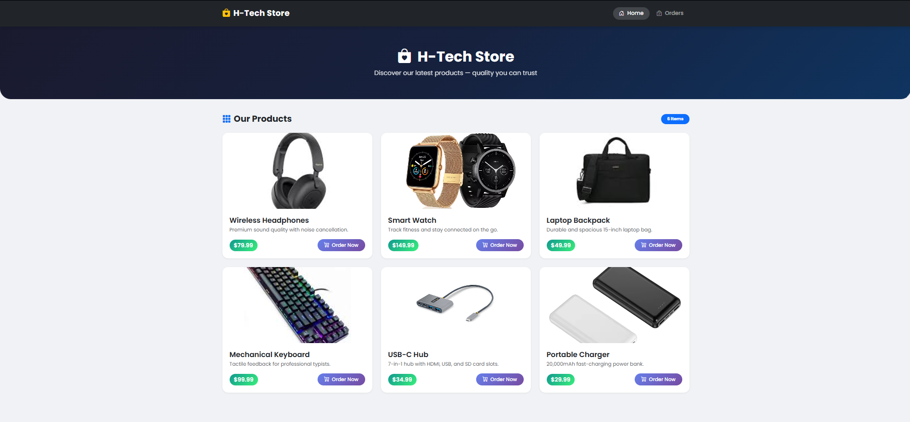
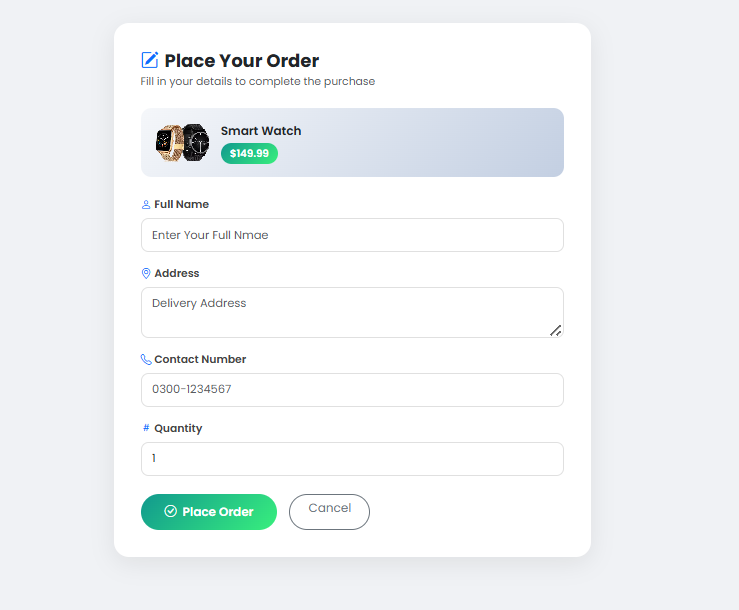
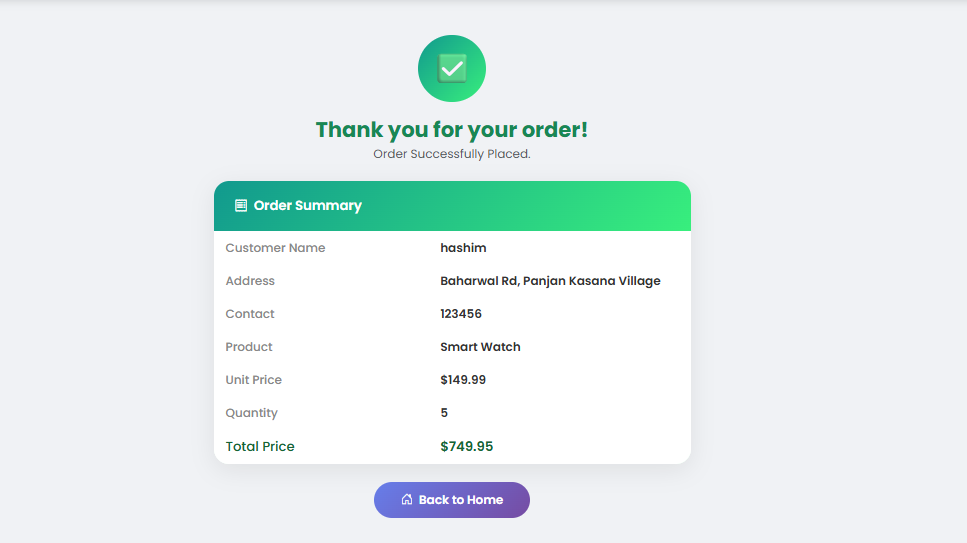

# 🛒 EcomerceStore — Blazor Server Assignment
---

## 📌 Project Overview

EcomerceStore is a **Blazor Server** web application that demonstrates a complete e-commerce product showcase and ordering system. Built using **.NET 8**, **Bootstrap 5**, and **Dependency Injection**, the app allows users to browse products, place orders, and view order confirmations.

---

## 🖥️ Screenshots

### Home Page — Product Showcase

> *Bootstrap card grid showing all 6 products with images, names, prices, and Order Now buttons*

---

### Order Form Page

> *Customer fills in Name, Address, Contact Number, and Quantity using @bind — selected product shown read-only at top*

---

### Order Confirmed Page

> *Thank you page showing full order summary including product name, quantity, unit price, and total price*

---

## 🗂️ Project Structure

```
EcomerceStore/
│
├── Models/
│   ├── Product.cs              # Product blueprint (Id, Name, Price, ImageUrl, Description)
│   └── Order.cs                # OrderModel (CustomerName, Address, Contact, Quantity, TotalPrice)
│
├── Services/
│   ├── ProductService.cs       # GetProducts() and GetProductById(id)
│   └── OrderService.cs         # PlaceOrder() and GetLastOrder()
│
├── Components/
│   ├── App.razor               # HTML shell — Bootstrap CDN + all CSS styles
│   ├── Routes.razor            # Router with MainLayout as default
│   ├── _Imports.razor          # Global @using statements
│   │
│   ├── Layout/
│   │   ├── NavMenu.razor       # Side navigation bar (Home + Orders links)
│   │   └── MainLayout.razor    # Master layout — sidebar + content + footer
│   │
│   └── Pages/
│       ├── Home.razor          # / — Product cards grid
│       ├── OrderForm.razor     # /orderform/{id} — Order form with @bind
│       ├── OrderConfirmed.razor# /orderconfirmed — Thank you + summary
│       └── Orders.razor        # /orders — Last order details
│
├── wwwroot/
│   ├── images/                 # Local product images folder
│   │   ├── headphones.jpg
│   │   ├── smartwatch.jpg
│   │   ├── backpack.jpg
│   │   ├── keyboard.jpg
│   │   ├── usbhub.jpg
│   │   └── charger.jpg
│   └── css/
│
└── Program.cs                  # Service registration (AddScoped)
```

---

## ⚙️ Technologies Used

| Technology | Purpose |
|---|---|
| Blazor Server (.NET 8) | Main framework |
| Bootstrap 5 | Responsive UI layout and components |
| Bootstrap Icons | Icon library for navbar and buttons |
| Google Fonts (Poppins) | Typography |
| C# Dependency Injection | Service registration with AddScoped |

---

## 🔧 Services (Dependency Injection)

Both services are registered as **Scoped** in `Program.cs`:

```csharp
builder.Services.AddScoped<ProductService>();
builder.Services.AddScoped<OrderService>();
```

### ProductService
```csharp
public List<Product> GetProducts()           // Returns all 6 products
public Product? GetProductById(int id)       // Returns one product by Id
```

### OrderService
```csharp
public void PlaceOrder(OrderModel order)     // Saves the order
public OrderModel? GetLastOrder()            // Retrieves last saved order
```

---

## 📄 Models

### Product.cs
```csharp
public class Product
{
    public int Id { get; set; }
    public string Name { get; set; }
    public decimal Price { get; set; }
    public string ImageUrl { get; set; }
    public string Description { get; set; }
}
```

### Order.cs (OrderModel)
```csharp
public class OrderModel
{
    public string CustomerName { get; set; }
    public string Address { get; set; }
    public string ContactNumber { get; set; }
    public int Quantity { get; set; }
    public Product? Product { get; set; }
    public decimal TotalPrice => (Product?.Price ?? 0) * Quantity; // Computed
}
```

---

## 🗺️ App Flow

```
User visits /  (Home)
    └── ProductService.GetProducts() → 6 product cards shown

User clicks "Order Now"
    └── NavigationManager → /orderform/{productId}

OrderForm loads
    └── ProductService.GetProductById(id) → product shown read-only
    └── User fills: Name, Address, Contact, Quantity (@bind)

User clicks "Place Order"
    └── OrderService.PlaceOrder(order) → order saved
    └── NavigationManager → /orderconfirmed

OrderConfirmed loads
    └── OrderService.GetLastOrder() → shows full summary
    └── TotalPrice = Price × Quantity (auto-computed)

User clicks "Orders" in sidebar
    └── /orders → same last order shown
```

---

## ✅ Requirements Checklist

| Requirement | File | Status |
|---|---|---|
| Bootstrap navbar with Home & Orders | `NavMenu.razor` | ✔ Done |
| Home page with responsive product grid | `Home.razor` | ✔ Done |
| Product image, name, price on cards | `Home.razor` | ✔ Done |
| Order Now button → OrderForm | `Home.razor` | ✔ Done |
| OrderForm with @bind fields (Name, Address, Contact, Qty) | `OrderForm.razor` | ✔ Done |
| Product name & price shown read-only | `OrderForm.razor` | ✔ Done |
| Place Order saves via OrderService & navigates | `OrderForm.razor` | ✔ Done |
| OrderConfirmed shows product, qty, total, thank you | `OrderConfirmed.razor` | ✔ Done |
| Back to Home button on confirmation page | `OrderConfirmed.razor` | ✔ Done |
| ProductService scoped — GetProducts, GetProductById | `ProductService.cs` + `Program.cs` | ✔ Done |
| OrderService scoped — PlaceOrder, GetLastOrder | `OrderService.cs` + `Program.cs` | ✔ Done |

---

## 🚀 How to Run

1. Open `EcomerceStore.sln` in **Visual Studio 2022 / 2026**
2. Ensure **.NET 8 SDK** is installed
3. Press **`Ctrl + F5`** to build and run
4. Browser opens automatically at `localhost` port
5. Use the sidebar to navigate: **Home** and **Orders**

